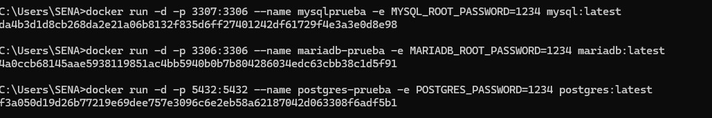
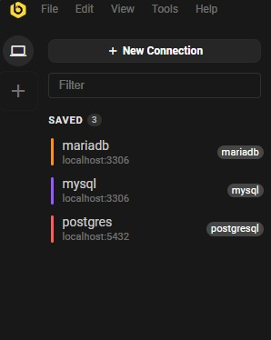
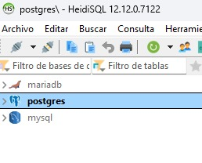
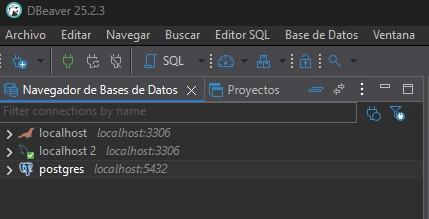
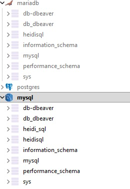
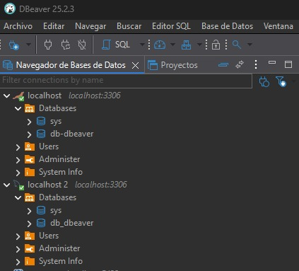

## **Uso de Docker**

#### Ficha: 3203084
#### Formación: ADSO
#### Nombre: Juan Pablo Mozuca Chaparro 

En este archivo documentare el paso a paso de los requisitos pedidos en la actividad. 

### **Paso a Paso**

Primero hay que instalar docker desktop buscandolo en su buscador designado

#### 1. Comandos iniciales

Primero hay que instalar las 3 bases de datos que necesitamos, las cuales son MariaDB, mySQL y Postgres

~~~

- docker pull mariadb
- docker pull mysql
- docker pull postgres

~~~

Y pasamos a crear y correr los contenedores los cuales se crean con estos siguientes comandos

~~~

- docker run -d -p3306:3306 -e --name mariadb-prueba MARIADB_ROOT_PASSWORD:1234 mariadb
- docker run -d -p3307:3306 -e --name mysqlprueba MYSQL_ROOT_PASSWORD:1234 mysql
- docker run -d -p5432:5432 -e --name postgres-prueba POSTGRES_PASSWORD:1234 postgres

~~~

Como se ve en la consola: 

### 2. Clientes 

Para este paso instalaremos 3 clientes distintos, DBeaver, HeidiSQL y Beekeeper, en el cual accederemos a ellos y crearemos las bases de datos correspondientes a cada uno de los clientes

### 3. Conectarse a containers

En este paso, conectaremos los 3 containers que teniamos, para que queden asi (es muy facil entender como, en Heidisql se llaman sesiones, en Dbeaver son conexiones, y en beekeeper lo tienes que guardar): 

## Beekeeper 

Para conectarse a un container en beekeper, solo tienes que abrirlo, y te aparecera una pestaña, donde escojes el programa, y ya con el usuario y contraseña que elegiste, guardas las 3 conexiones y listo

## HeidiSQL

Tendras que crear 3 sesiones, y guardar sus datos para tener los 3 containers abiertos

## DBeaver

En dbeaver tienes que darle clic en la parte que aparecen las databases, y le das a nueva conexión y la siguiente parte es la misma que en beekeeper 

### 4. Bases de datos

Y al final crearemos bases de datos dentro de cada container, y es muy facil crearlas

## Beekeeper 

En Beekeper, tienes que darle en el botón select a database que parecer un buscador, y ahi añades tus database o bases de datos, curiosamente, es el unico limitado, ya que tienes que abrir otra ventana si quieres acceder a otra conexion

## HeidiSQL

En Heidisql es mas facil, ya que en el apartado que salen las sesiones, tienes que darle en databases, y te saldra el boton de crear una nueva database

## DBeaver

Lo mismo que en heidisql, le das en databases y crear un nuevo database, y ya los tendras

### Conclusiones

Es bastante facil crear bases de datos dentro de los clientes, y es una forma de manejar dichas bases de datos.

Definitivamente, docker es un gran paso para el desarrollo de proyectos a futuro

